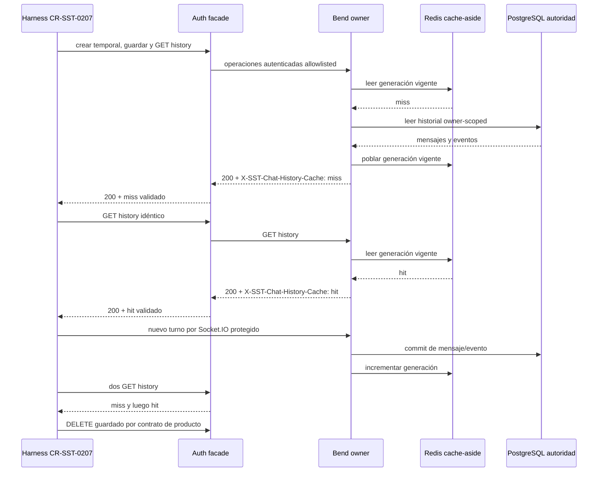

# Plan de QA product-safe para el cache del historial de chat

Fecha observada: 2026-08-28.

## Resultado del relevamiento

La reserva de `CR-SST-0230` quedó canónica en
`origin/main@b67aa36`. Después de refrescar los owners, Bend continúa en
`origin/develop@9faae46` y Auth en `origin/develop@b9c38fc`; no aparecieron
merges posteriores que cambien el boundary relevado. El worktree del plan se
adelantó además al `origin/main@c0880c2`, incorporando los PR `#171` y `#172`
sin conflicto ni solapamiento con esta CR.

El runtime actual ya implementa cache-aside para conversaciones guardadas:
PostgreSQL revalida existencia y ownership, Redis almacena mensajes y eventos
por generación, y cada append comprometido incrementa esa generación. Ante
un miss o una falla de Redis, Bend lee PostgreSQL. Sin embargo, las dos rutas
de lectura devuelven solamente arrays y el controller no puede distinguir de
forma segura el origen de la respuesta. Auth preserva status y body, pero
descarta toda metadata de response upstream.

Este plan no modifica repos hijos, Jira, runtime, Redis, PostgreSQL, secretos,
deployment ni producción. La ejecución owner requiere un lifecycle `running`
canónico y una autorización humana posterior.

## Decisión de contrato

Bend producirá el header:

```text
X-SST-Chat-History-Cache: hit|miss|bypass
```

La señal aparecerá únicamente en respuestas `200` de
`GET /4uentes/v1/chat/conversations/:id/messages`. Auth reenviará la misma
señal únicamente en el `200` correspondiente de
`GET /api/chat/conversations/:id/messages`, después de validar que exista un
solo valor y que sea exactamente `hit`, `miss` o `bypass`.

- `hit`: mensajes y eventos provinieron de la generación Redis vigente. Un
  array vacío ya cacheado sigue siendo hit.
- `miss`: Redis estaba operativo, pero al menos una de las dos particiones no
  estaba en la generación vigente y PostgreSQL completó esa lectura.
- `bypass`: el historial era volátil, Redis no estaba configurado o Redis no
  estaba disponible y la lectura durable siguió por PostgreSQL.

Para un resultado mixto, la precedencia será `bypass`, luego `miss`, luego
`hit`. El resultado se transportará como metadata request-scoped desde el
store hacia el service y el controller; queda prohibido guardar un “último
resultado” mutable en un singleton porque mezclaría requests concurrentes.

La señal no modifica body, status, ownership, orden de escrituras, autoridad
durable ni comportamiento fail-open. No incluye IDs, principals, contenido,
keys, URLs, credenciales, latencia o detalle de errores. Un `400`, `401`,
`403`, `404`, `409` o `5xx` no expone el header. Auth descarta valores
repetidos, desconocidos o malformados y cualquier otro header upstream de
cache o timing.

## Mapa de secuencia y autoridad

<!-- visual-map:start -->

```yaml
visual_map:
  schema_version: "1.0"
  id: "cr-sst-0230-product-cache-qa-sequence"
  type: "sequence"
  question: "¿Cómo prueba el harness miss-hit después de una invalidación normal sin acceder directamente a Redis?"
  abstraction_level: "cross-repo saved-chat cache QA"
  source_refs:
    - "requests/inbox/CR-SST-0230-product-safe-chat-cache-qa.yaml"
    - "requests/planned/CR-SST-0230-product-safe-chat-cache-qa.yaml"
    - "requests/running/CR-SST-0207-integrated-chat-retention-qa.yaml"
    - "evidence/requests/CR-SST-0230/identity-and-owner-preflight-2026-08-28.md"
  observed_at: "2026-08-28"
  authority_boundary: "Vista derivada; Bend conserva cache y autoridad durable, Auth el facade HTTP y el control-plane lifecycle/evidencia."
  textual_fallback_required: true
```



### Fallback textual del mapa

```text
1. El harness de CR-SST-0207 crea, completa y guarda una conversación sintética por los paths protegidos existentes.
2. El primer GET history consulta Redis; si falta la generación, Bend lee PostgreSQL y responde miss.
3. El segundo GET idéntico usa la generación poblada y responde hit.
4. Un turno sintético normal se compromete en PostgreSQL y avanza la generación de Redis.
5. Los siguientes dos GET responden miss y hit, demostrando invalidación acotada sin comandos Redis.
6. Auth sólo reenvía el enum válido y el harness elimina la conversación mediante DELETE /api/chat.
```

<!-- visual-map:end -->

## Ownership y superficies

`sst-bend` es productor y autoridad. La ejecución prevista actualizará el
cache/store, service y route de chat, sus pruebas focalizadas y estas
superficies owner:

- `specs/api/chat-retention-v1.yaml`;
- `specs/capabilities/outbound/chat-retention-v1.yaml`;
- `docs/api/chat-retention.md`;
- `docs/capabilities/outbound/chat-retention-v1.md`;
- un task report de `CR-SST-0230` y `httpPruebas/sst.chat.http`.

`4uentes-auth` es consumidor inbound y productor del facade. Actualizará
`src/presentation/chat/routes.ts`, pruebas del facade y:

- `specs/integrations-api.yaml` y `specs/routing.yaml`;
- capabilities inbound/outbound de `chat-retention-v1`;
- `docs/bf/03-routing.md`, `docs/bf/06-integrations-api.md` y
  `docs/chat-sessions.md`;
- docs derivadas de capabilities y `httpPruebas/sst_server.http`.

`sst-fend` no necesita consumir esta señal: el harness integrado es su único
consumidor QA. `sst-chatbot` participa en el turno normal pero no cambia su
contrato. Infra conserva Redis y las variables existentes; tampoco cambia.

## Unidades de ejecución y DoD

| Unidad | Owner | Riesgo | Definition of Done |
| --- | --- | --- | --- |
| Publicar plan | control-plane | medio | PR fusionado, readback remoto y `npm run check` PASS |
| Publicar running | control-plane | medio | autorización exacta, lifecycle fusionado y ref owner fresca |
| Producir señal | sst-bend | alto | hit/miss/bypass request-scoped, fail-open y concurrencia probados; owner docs alineadas |
| Reenviar señal | 4uentes-auth | alto | allowlist history-only, enum exacto, malformed/error drop y owner docs alineadas |
| Publicar owners | Bend/Auth | alto | PR Bend fusionado primero; Auth consume el contrato publicado; ambos readbacks PASS |
| Jira mirror | control-plane | medio | duplicados, jerarquía, lote exacto autorizado y readback PASS |
| QA integrada | control-plane | alto | miss-hit, turno invalidante, miss-hit y cleanup por producto |
| Cierre | control-plane | medio | documentación/evidencia ARDS/SDD completa, full check y `done` canónico |

## Jira propuesto, todavía no autorizado

El candidato es una `Subtask` de `SST-113` porque representa una unidad
ejecutable acotada del programa de retención, aunque coordine dos owners:

`[CR-SST-0230] Habilitar QA product-safe de cache del chat`

Antes de cualquier escritura se repetirá JQL de duplicados y el readback de
Epic, Task padre, tipo y estado. Crear o transicionar ese único issue requiere
una autorización de lote separada. No se autoriza modificar `SST-117`, agregar
comentarios, links, labels, assignee ni editar otros issues.

## Gates pendientes

1. Fusionar y releer este lifecycle `planned` desde `origin/main`.
2. Obtener autorización exacta para publicar `running` y luego mutar Bend/Auth
   en worktrees limpios.
3. Publicar Bend, releer su capability y recién entonces implementar Auth.
4. Autorizar por separado el lote Jira luego de un preflight fresco.
5. Ejecutar la secuencia integrada, limpiar por contrato de producto y cerrar
   ARDS/SDD con owner docs, evidencia y full checks.
