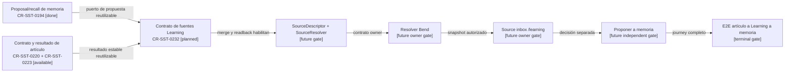

# Plan del contrato de fuentes de Learning Workspace

## Propósito del gate

`CR-SST-0232` define cómo `/learning` pedirá y recibirá una fuente gobernada.
Este gate publica solamente el plan del control plane: no crea endpoints,
migraciones, resolvers ni componentes frontend.

El objetivo es que texto manual, artículos, documentos de artículo y
resultados de agente entren al mismo workspace mediante un contrato extensible,
sin convertir al navegador en autoridad de contenido, autorización o memoria.

## Decisiones principales

1. `SOURCE_DESCRIPTOR` identifica la fuente solicitada; no es el contenido
   canónico ni una autorización.
2. `SOURCE_RESOLVER` vive server-side, reconstruye el principal confiable,
   autoriza el objeto owner y genera un `LEARNING_SOURCE_SNAPSHOT` inmutable.
3. El snapshot conserva kind, referencias owner, versión, hash, tiempo de
   captura y procedencia sanitizada.
4. `manual_text` mantiene compatibilidad con la hoja actual. Para fuentes ya
   persistidas, el browser envía referencias estables y no copia el body
   privado por Redux o storage.
5. Una fuente cambiada, borrada, no ready o fuera de scope falla cerrada. Una
   versión nueva genera otro snapshot.
6. Los tags se aplican después de resolver el snapshot; el contrato no mezcla
   `ArticleTag`, tags de fragmento ni clasificación de memoria.
7. Aceptar `LearningContext` no acepta memoria. La propuesta a memoria será
   una acción separada y entrará en `needs_review`.
8. `SecretRef` y adquisición credentialed quedan fuera de V1 y requieren un
   lifecycle de seguridad propio.

## Mapa de adopción

<!-- visual-map:start -->

```yaml
visual_map:
  schema_version: "1.0"
  id: "learning-workspace-source-contract-adoption-gates"
  type: "lifecycle"
  question: "¿Cómo avanza el contrato de fuentes desde la reserva hasta un workspace Learning validado?"
  abstraction_level: "Gates del control plane y futuros owners Bend/Fend."
  source_refs:
    - "requests/inbox/CR-SST-0232-define-learning-workspace-source-contract.yaml"
    - "requests/planned/CR-SST-0232-define-learning-workspace-source-contract.yaml"
    - "evidence/requests/CR-SST-0232/reservation-readback-2026-08-29.md"
  observed_at: "2026-08-29"
  authority_boundary: "Vista derivada; el lifecycle del control plane y los futuros ARDS/SDD owner conservan autoridad."
  textual_fallback_required: true
  request_ids: ["CR-SST-0232", "CR-SST-0194", "CR-SST-0220", "CR-SST-0223"]
```



### Fallback textual

```text
CR-SST-0194 aporta el proposal/recall de memoria ya cerrado. CR-SST-0220 y CR-SST-0223 aportan el contrato y el resultado gobernado de artículos. Esos requests son predecesores de CR-SST-0232. El plan fusionado habilitará materializar SourceDescriptor y SourceResolver. Ese contrato permitirá un resolver owner en Bend, luego el source inbox de /learning en Fend, después la acción independiente de proponer a memoria y finalmente el E2E completo.
```

<!-- visual-map:end -->

## Contrato mínimo a materializar en el gate running

### Descriptor común

Todo descriptor tendrá un discriminador `source_kind`, una referencia estable,
un idempotency key y, cuando exista, versión o hash esperado. No contendrá
tokens, credenciales ni bodies owner-persistidos.

### Kinds iniciales

| Kind | Referencia mínima | Regla |
| --- | --- | --- |
| `manual_text` | `client_source_id` y texto explícito | Preserva el flujo actual y captura un snapshot al iniciar preview. |
| `article` | `article_id` | Bend autoriza y resuelve la versión persistida. |
| `article_document` | `article_id`, `document_id` | El documento debe pertenecer al artículo y estar ready. |
| `agent_output` | `article_id`, `article_processing_result_id` | Reutiliza el resultado estable; referencias legacy se adaptan server-side. |

### Resultado de resolución

El resolver devuelve metadata de snapshot y contenido sólo al pipeline
autorizado de Learning. La UI recibe identidad, estado, versión y procedencia
necesaria para revisar; no recibe secretos ni permisos implícitos.

## Casos negativos obligatorios

- source de otro tenant, account, user o application;
- documento que no pertenece al artículo;
- procesamiento todavía no ready o sin resultado estable;
- versión o hash distintos entre preview y accept;
- source borrado después del preview;
- kind o combinación de referencias inválidos;
- replay con idempotency incompatible;
- intento de usar `secretRef` como contenido;
- intento de convertir accept de Learning en accept de memoria.

## Orden de adopción

1. Publicar y leer este planned lifecycle.
2. Hacer discovery owner read-only y materializar el contrato versionado bajo
   un gate `running` autorizado por separado.
3. Reservar requests independientes para resolver en Bend, adoptar la UX en
   Fend y validar E2E.
4. Implementar primero el resolver y después el source inbox.
5. Añadir el puente a memoria como decisión explícita, reutilizando el canon
   de `CR-SST-0194`.
6. Ejecutar browser QA con fixtures creados desde la UI y evidencia sanitizada.

## Fuera de alcance

- cambiar `sst-bend`, `sst-fend`, `sst-chatbot` o Auth;
- aceptar memoria automáticamente;
- redefinir el pipeline de procesamiento de artículos;
- adquirir fuentes con credenciales o manipular secretos;
- publicar o transicionar Jira;
- desplegar o migrar runtime.

## Criterio de salida

El plan queda listo para publicación cuando `npm run check`, el validador de
mapas y `git diff --check` pasan. La publicación, el merge y el readback
requieren aprobación explícita; tampoco autorizan el gate `running`.
