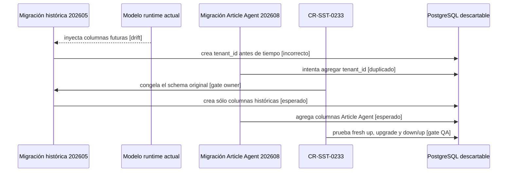

# Plan de reconciliación del baseline de migraciones SST

## Propósito

`CR-SST-0233` registra el defecto de instalación limpia descubierto después de
la publicación de `CR-SST-0223`. Este gate sólo publica el lifecycle y el plan;
no modifica `sst-bend`, Jira, runtime, infraestructura ni bases compartidas.

El delta anterior que existe en el worktree
`CR-SST-0233-migration-reconciliation` permanece en cuarentena. Este documento
se creó desde `origin/main@30953a1` y no convierte ese árbol anterior en fuente
de promoción.

## Observación y límite de autoridad

La evidencia local sanitizada informó que una cadena completa sobre PostgreSQL
16 descartable llega a
`20260829010000-adopt-article-agent-processing-v1` y falla al agregar
`document_agent_jobs.tenant_id` porque la columna ya fue creada.

La revisión owner identificó la causa: la migración histórica
`20260524120000-create-document-agent-jobs` importa el schema runtime actual.
Cuando el modelo incorpora columnas futuras, una instalación vacía las crea
antes de que se ejecute la migración que contractualmente las posee.

Esta observación no reemplaza la evidencia futura del owner. `sst-bend`
conserva autoridad sobre migraciones, modelos, tests y documentación técnica;
el control-plane conserva autoridad sobre lifecycle, gates y evidencia de
orquestación.

## Decisión

La estrategia preferida es congelar en la migración histórica la forma original
de `document_agent_jobs` y mantener en la migración de adopción la propiedad
exclusiva de las columnas Article Agent. No se aceptará ocultar drift mediante
un `catch-and-ignore` general.

## Secuencia causal y gates

<!-- visual-map:start -->

```yaml
visual_map:
  schema_version: "1.0"
  id: "cr-sst-0233-fresh-database-migration-reconciliation"
  type: "sequence"
  question: "¿Por qué falla una instalación limpia y qué gates restauran una cadena determinística?"
  abstraction_level: "Secuencia de ownership de schema y gates del lifecycle correctivo."
  source_refs:
    - "requests/inbox/CR-SST-0233-reconcile-fresh-database-migration-baseline.yaml"
    - "requests/planned/CR-SST-0233-reconcile-fresh-database-migration-baseline.yaml"
    - "evidence/requests/CR-SST-0233/implementation-plan.md"
  request_ids: ["CR-SST-0233"]
  observed_at: "2026-08-30"
  authority_boundary: "Vista derivada del diagnóstico; sst-bend conserva autoridad owner y el control-plane conserva el lifecycle."
  textual_fallback_required: true
```



### Fallback textual

```text
La migración 202605 toma hoy el modelo runtime y adelanta tenant_id. La migración 202608, que posee esa columna, intenta agregarla y la instalación limpia falla. CR-SST-0233 debe congelar el schema original de 202605, conservar en 202608 la evolución Article Agent y probar instalación limpia, upgrade histórico y rollback/reaplicación sobre PostgreSQL descartable.
```

<!-- visual-map:end -->

## Matriz de validación futura

| Camino | Estado inicial | Resultado requerido |
| --- | --- | --- |
| Fresh install | PostgreSQL vacío | Todas las migraciones `up`, sin columnas duplicadas. |
| Upgrade | Schema histórico con 202605 aplicada | 202608 agrega exactamente las columnas nuevas y preserva fixtures sintéticos. |
| Down/up | Target Article Agent aplicado | Rollback y reaplicación sin drift, o residual explícito aprobado. |
| Paridad final | Ambos caminos completos | Columnas, índices, constraints y nullability equivalentes. |
| Runtime | Schema final | Sequelize inicia sin `alter` o sincronización implícita. |
| Integración HPT | Cadena completa | Receipt intake y binding siguen aplicando y sus smokes permanecen verdes. |

No se permiten seeders, dumps, contenido privado, credenciales ni acceso a un
entorno compartido.

## Gates

1. Fusionar y leer este lifecycle desde `origin/main`.
2. Publicar un running lifecycle con base owner refrescada, paths exactos y
   autorización independiente.
3. Crear un worktree limpio de `sst-bend` desde `origin/develop`; el worktree
   anterior a esta publicación no es una fuente válida.
4. Actualizar código, regresiones y documentación owner en el mismo lifecycle.
5. Ejecutar las rutas de base de datos y los checks owner.
6. Ejecutar `npm run check` completo en el control-plane antes del cierre.
7. Publicar por PR, leer refs remotas y recién entonces preparar cualquier
   lote terminal de Jira.

## Criterio de salida

Este gate queda listo cuando `npm run check`, `git diff --check`, el escaneo de
secretos y el readback remoto pasan. La mutación owner y la escritura Jira
permanecen fuera de esta autorización.
