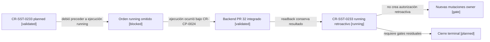

# Reconciliación retroactiva del lifecycle running de CR-SST-0233

## Resultado

`CR-SST-0233` tenía reserva y plan canónicos, pero su corrección owner fue
integrada dentro del Backend PR #32 antes de publicar el estado `running`. Esta
evidencia registra la desviación sin reescribir historia y sin convertirla en
una autorización retroactiva.

La consulta remota del PR confirmó:

- PR owner: `afpogo/sst-bend#32`, estado `MERGED`;
- head autorizado por `CR-CP-0024`: `de19c14f95c077a2b85a1bbdd205d01a512cbd00`;
- merge en `develop`: `5db4dd868f3348f95d6376519be1534be1710d75`;
- paths de la corrección: migración histórica congelada, documentación owner y
  regresión PostgreSQL;
- evidencia coordinadora: fresh install, upgrade con datos, down/up, paridad y
  check owner pasaron.

No se ejecutó una nueva migración ni se modificó `sst-bend` para producir este
documento.

## Mapa de precedencia y contención

<!-- visual-map:start -->

```yaml
visual_map:
  schema_version: "1.0"
  id: "cr-sst-0233-retroactive-running-containment"
  type: "lifecycle"
  question: "¿Cómo se contiene la ejecución owner que precedió al lifecycle running de CR-SST-0233?"
  abstraction_level: "request lifecycle deviation"
  source_refs:
    - "requests/planned/CR-SST-0233-reconcile-fresh-database-migration-baseline.yaml"
    - "requests/running/CR-SST-0233-reconcile-fresh-database-migration-baseline.yaml"
    - "evidence/requests/CR-CP-0024/backend-merge-rollout-and-health-readback-2026-08-31.md"
  observed_at: "2026-09-05"
  authority_boundary: "Vista derivada; los lifecycles publicados y los readbacks Git conservan autoridad."
  textual_fallback_required: true
  request_ids: ["CR-SST-0233", "CR-CP-0024"]
```



### Fallback textual del mapa

```text
CR-SST-0233 planned --debió preceder a ejecución running--> Orden running omitido
Orden running omitido --ejecución ocurrió bajo CR-CP-0024--> Backend PR 32 integrado
Backend PR 32 integrado --readback conserva resultado--> CR-SST-0233 running retroactivo
CR-SST-0233 running retroactivo --no crea autorización retroactiva--> Nuevas mutaciones owner
CR-SST-0233 running retroactivo --requiere gates residuales--> Cierre terminal
```

<!-- visual-map:end -->

## Excepción de worktree

El worktree anterior `worktrees/CR-SST-0233-migration-reconciliation` permanece
dirty con evidencia no trackeada y una modificación de iniciativa. No fue
limpiado, reseteado ni usado como fuente. La publicación se realiza desde
`worktrees/CR-SST-0233-retroactive-running`, creado limpio desde
`origin/main@b8a81958512a128a5000ab267dcb74b0332c6414`.

La excepción permite dos árboles sólo mientras se preserva y clasifica la
información única del árbol anterior. El nuevo worktree pertenece
exclusivamente a la publicación control-plane; su merge no habilita borrar el
árbol legacy.

## Estado posterior

El gap `planned → running` queda reconciliado cuando este lifecycle se fusiona
y se relee desde `origin/main`. `CR-SST-0233` no queda terminal: continúan
separados el blocker de salud ClamAV, la disposición del mirror Jira y el
readback terminal. Ninguno se infiere a partir del merge de Backend.
