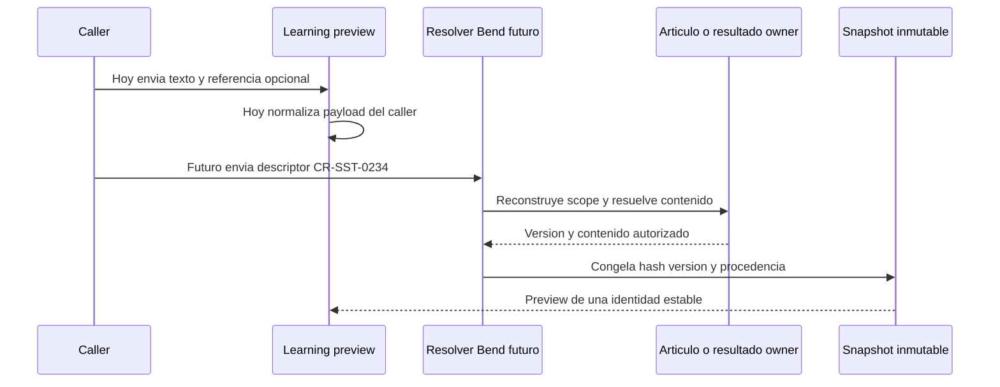

# Preflight read-only de sst-bend para CR-SST-0234

- Rol primario: evidencia de descubrimiento.
- Owner tecnico observado: `sst-bend`.
- Owner de la evidencia: `4uentes-orchestor`.
- Estado: PASS para preparar el lifecycle; implementacion no autorizada.
- Fecha observada: 2026-09-05.
- Fuentes tecnicas: `sst-bend@origin/develop` y contrato V1 del control plane.

## Baseline y aislamiento

`git ls-remote` confirmo que `refs/heads/develop` apunta a `5db4dd868f3348f95d6376519be1534be1710d75`; el `origin/develop` local coincide. No se encontro rama local/remota ni PR con identidad `CR-SST-0234`.

El checkout principal de Bend esta en `efa955bf` sobre una rama ajena y contiene modificaciones y archivos no trackeados de otros lifecycles. Fue observado sin cambios y queda prohibido reutilizarlo. Un eventual gate owner debera crear un worktree limpio desde el SHA remoto confirmado.

## Estado observado

- `api.learning-workspaces@1.1.0` expone preview, accept, reject y accepted-only context.
- El preview exige `sourceText`, `rawText`, `html` o contenido de documentos enviado por el caller.
- `article` y `originArticleId` son linkage opcional; no disparan resolucion autoritativa server-side.
- `LearningSourceRef` guarda fingerprints, payload JSONB y estado, pero no modela una identidad explicita de snapshot inmutable V1.
- Bend ya posee articulos, `article_documents`, `document_agent_jobs` y resultados `agent_summary` reutilizables por adaptadores owner.
- El scope autenticado, el review explícito y el contexto accepted-only son boundaries existentes que deben preservarse.

## Mapa del gap owner

<!-- visual-map:start -->

```yaml
visual_map:
  schema_version: '1.0'
  id: 'cr-sst-0234-bend-resolver-gap'
  type: 'sequence'
  question: 'Que cambia entre el preview actual y el resolver autoritativo de CR-SST-0234?'
  abstraction_level: 'Boundary de resolucion y snapshot en Bend.'
  source_refs:
    - 'requests/running/CR-SST-0234-implement-learning-source-resolver-and-snapshots.yaml'
    - 'evidence/requests/CR-SST-0232/learning-workspace-source-contract-v1.yaml'
  request_ids: ['CR-SST-0234']
  observed_at: '2026-09-05'
  authority_boundary: 'Vista derivada del canon Bend observado; las specs owner futuras conservaran autoridad runtime.'
  textual_fallback_required: true
```



### Fallback textual

```text
Hoy el caller envia el cuerpo y Learning lo normaliza, mientras la referencia owner es opcional. CR-SST-0234 introducira un resolver Bend que reconstruye el scope, obtiene la version autoritativa del articulo, documento o resultado y crea un snapshot inmutable con hash y procedencia antes del preview. El mapa no autoriza esa implementacion.
```

<!-- visual-map:end -->

## Superficies owner requeridas

- `specs/api/learning-workspaces.yaml` y `docs/api/26-learning-workspaces.md`;
- capability outbound `learning-workspace-context` y su documento humano;
- contrato/versionado del resolver y snapshot;
- adaptadores de articulo, article document y agent output;
- migracion reversible si el modelo persistente cambia;
- tests de autorizacion, aislamiento, idempotencia, stale source, integridad y exclusion de secretos;
- playbook owner, mapas y runbook con stop conditions y rollback.

## Stop conditions para el futuro gate owner

- `develop` remoto cambia antes de crear el worktree;
- existe otra rama o PR `CR-SST-0234`;
- el contrato owner contradice el V1 del control plane;
- no puede garantizarse que valores secretos queden fuera de payload, snapshot, logs y evidencia;
- la migracion propuesta no es reversible o invade ownership de otro agregado.

No se ejecuto ningun check owner, runtime ni migracion porque este preflight fue exclusivamente read-only.
