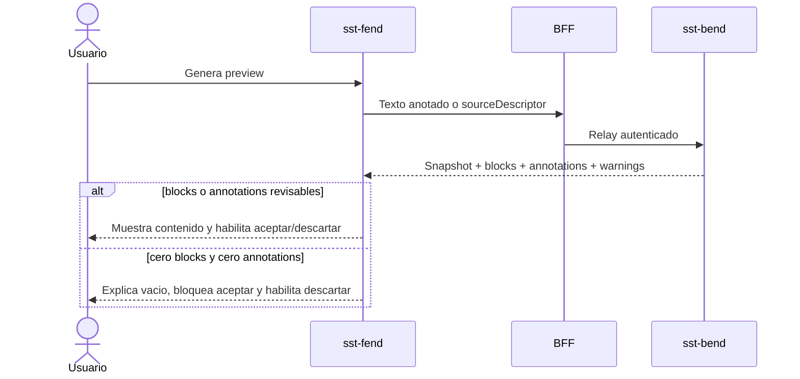

# Checkpoint De QA Manual Y Ajustes Owner CR-SST-0236

Owner documental: `4uentes-orchestor`. La autoridad del codigo y la
documentacion frontend permanece en `sst-fend`.

## Readback De Publicacion Y Runtime

- PR owner: `afpogo/sst-fend#19`.
- Merge: `d1e9ef5e578220ea666d033c05ba2cccb1bb7e8e`.
- Imagen observada: `ghcr.io/afpogo/sst-fend:develop-d1e9ef5e5782`.
- Infra: `b20bcc8f5f7947b9a06e3f461a58ecd190646945`.
- Rollout: completado correctamente antes del QA.

## Alcance Ejecutado

El 2026-09-12 se uso una ventana independiente de Chrome DevTools MCP con
sesion autenticada. Se verificaron `/learning`, seleccion manual, cambio de
tipos de fuente, un articulo owner existente, una referencia negativa de
documento, payload/response de red, consola y layout desktop/mobile.

No se ejecutaron `accept`, `reject`, seeders, escrituras directas en base,
cambios de secretos, Jira ni mutaciones de runtime. Los identificadores owner
observados no se copian en esta evidencia.

## Resultado

1. El preview manual respondio `200` con una anotacion normalizada valida, pero
   la UI lo presento como vacio porque solo renderizaba bloques materializados.
2. El request manual incluyo `documentSelectors.learningSheet`; Bend devolvio
   `unsupported_document_selector` porque v1 no lo soporta.
3. Al cambiar de fuente permanecia visible el mensaje de exito del preview
   anterior.
4. El 404 sanitizado de una referencia persistida ficticia quedaba oculto por
   estado de la paleta exclusiva de texto manual.
5. Un articulo owner se resolvio y congelo correctamente sin `sourceText`
   caller, pero produjo cero bloques y cero anotaciones; aun asi la accion de
   aceptar estaba habilitada.
6. El responsive fue usable. La unica entrada de consola relevante fue el 404
   deliberado del caso negativo.

## Ajuste Owner Local

- Repositorio: `afpogo/sst-fend`.
- Baseline: `develop@d1e9ef5e578220ea666d033c05ba2cccb1bb7e8e`.
- Branch local: `agent/cr-sst-0236-learning-source-inbox-qa-fixes`.
- Commit local: `851bad5` (`fix(learning): clarify preview reviewability`).
- Publicacion: no realizada y no autorizada en este gate.

El ajuste:

- presenta las anotaciones normalizadas como selecciones etiquetadas;
- elimina el selector de documento que v1 rechaza;
- limpia preview y feedback al cambiar la fuente;
- muestra errores persistidos junto a su superficie;
- deshabilita aceptar cuando no hay bloques ni anotaciones, sin impedir
  descartar el preview;
- documenta que el discovery mediante UUID crudo sigue abierto y necesita un
  chooser respaldado por contratos owner.

## Mapa De Decision Del Preview

<!-- visual-map:start -->

```yaml
visual_map:
  schema_version: "1.0"
  id: "cr-sst-0236-preview-reviewability-gate-v1"
  type: "sequence"
  question: "Como evita Fend aceptar un preview sin contenido revisable?"
  abstraction_level: "QA y decision frontend posterior a la respuesta owner."
  source_refs:
    - "requests/running/CR-SST-0236-adopt-learning-source-inbox-user-experience.yaml"
    - "evidence/requests/CR-SST-0236/manual-qa-and-owner-fix-checkpoint-2026-09-12.md"
  observed_at: "2026-09-12"
  authority_boundary: "Vista derivada; sst-fend conserva autoridad sobre la implementacion y sst-bend sobre la resolucion."
  textual_fallback_required: true
```



### Fallback Textual

```text
1. Fend envia texto anotado o una referencia owner mediante el BFF.
2. Bend resuelve la fuente y devuelve snapshot, bloques, anotaciones y warnings.
3. Si existe al menos un bloque o anotacion, Fend muestra el contenido y permite decidir.
4. Si ambos conjuntos estan vacios, Fend bloquea aceptar, explica el problema y permite descartar.
```

<!-- visual-map:end -->

## Validacion Local

- Test focalizado: 17/17 PASS.
- `npm run check`: PASS.
- Build Webpack: PASS.
- Jest: 36 suites y 247 tests PASS.
- ESLint: cero errores; 22 warnings baseline fuera del lote.
- `git diff --check`: PASS.

## Manual Operativo De Prueba

Para convertir los hallazgos en una ronda repetible se agregaron al owner:

- `docs/playbook/learning-workspace-manual-test-playbook.md`: explica las cuatro
  fuentes, las ocho etiquetas, el modelo fuente/snapshot/preview/contexto, los
  niveles L0/L1/L2 y como clasificar bugs y gaps.
- `docs/tasks/2026-09-12-learning-workspace-manual-test-runbook.md`: ejecuta
  QA-00 a QA-16 con precondiciones, resultados esperados, evidencia,
  privacidad, stop conditions y compensacion.
- Commit local: `bf1b797` (`docs(learning): add manual QA playbook`).
- Publicacion: no realizada y no autorizada en este gate.
- Validacion posterior: `npm run check` PASS; Webpack PASS; 36 suites y 247
  tests PASS; cero errores ESLint y 22 warnings baseline.

El runbook separa L0 de solo lectura, L1 de preview y L2 de aceptar/descartar.
Los casos QA-15 y QA-16 quedan marcados `SKIPPED_NOT_AUTHORIZED` mientras no
exista autorizacion explicita de escritura sobre el fixture exacto.

## Proximo Gate

Publicar primero este checkpoint del control plane. Tras su merge/readback se
puede solicitar autorizacion exacta para publicar la branch owner y abrir un PR
de `sst-fend`. El deploy y la repeticion QA de los ajustes siguen siendo gates
posteriores; la validacion integrada completa permanece en `CR-SST-0237`.
