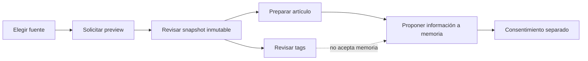

# Gate de inicio de la bandeja de fuentes de Learning

Owner documental: `4uentes-orchestor`. Rol primario: playbook y evidencia del
gate `running` de CR-SST-0236. La autoridad funcional futura de la interfaz y
sus contratos locales corresponde a `sst-fend`; este documento no la sustituye.

El usuario informó que el PR #298 estaba fusionado y autorizó avanzar. GitHub
confirmó el merge `327628f6ba77d5593304e1d71a0846ddb6bc2578` en `main` el
`2026-09-10T23:42:47Z`. La evidencia fusionada prueba que el BFF está desplegado
con Argo `Synced/Healthy`, la imagen `develop-d9263d180196` y el boundary
negativo `401` sin credenciales. La QA positiva con persistencia sigue pendiente
y no queda dispensada; pertenece al gate integrado CR-SST-0237.

## Decisión del gate

Se abre CR-SST-0236 sólo para publicar su lifecycle y preparar discovery de
lectura. Antes de tocar `sst-fend` deben existir: readback de este merge,
preflight owner actualizado y autorización explícita de ejecución owner.
La primera unidad implementable deberá publicar en Fend el contrato de
capability, el playbook UX, el mapa con fallback y el runbook de QA junto con el
código correspondiente.

No están autorizados en este gate: edición de `sst-fend`, deployment, Jira,
seeders, migraciones, escrituras de DB, preview/accept/reject, captura de
secretos ni contenido privado. La futura QA manual usará una sesión independiente
de Chrome DevTools MCP. Si una prueba necesita persistir contenido por la UI,
esa tensión con la prohibición de escrituras deberá resolverse antes de probar.

## Mapa del flujo objetivo

<!-- visual-map:start -->

```yaml
visual_map:
  schema_version: '1.0'
  id: 'learning-source-inbox-review-boundaries'
  type: 'lifecycle'
  question: 'Cómo pasa una fuente por snapshot y preparación de artículo sin convertir tags en memoria aceptada?'
  abstraction_level: 'Flujo UX objetivo de CR-SST-0236; no representa implementación ya disponible.'
  source_refs:
    - 'requests/planned/CR-SST-0236-adopt-learning-source-inbox-user-experience.yaml'
    - 'evidence/requests/CR-SST-0232/learning-workspace-source-contract-v1.yaml'
    - 'state/features/learning-workspace-source-contract.current.yaml'
  request_ids: []
  observed_at: '2026-09-10'
  authority_boundary: 'Vista derivada del objetivo; las specs owner publicadas por Bend, Auth y Fend conservan autoridad.'
  textual_fallback_required: true
```



### Fallback textual

```text
El usuario elige una fuente y solicita una vista previa; luego revisa identidad,
procedencia y frescura del snapshot inmutable. Desde esa revisión puede preparar
el artículo y revisar tags. Los tags no aceptan memoria. La incorporación de
información a memoria se presenta como una propuesta y requiere consentimiento
separado.
```

<!-- visual-map:end -->

## Stop conditions y siguiente gate

Detener si el owner actual contradice el contrato, si se requieren valores
secretos, si una fuente privada aparece sin control de acceso, si el frontend
debe enviar texto como autoridad de un artículo o si tags y memoria no pueden
separarse. No aplica rollback runtime porque este gate es documental; antes del
merge se compensa cerrando el PR y después mediante un revert gobernado.

El siguiente gate es fusionar y leer de vuelta este lifecycle, ejecutar el
preflight de solo lectura sobre `sst-fend` y presentar el alcance exacto de la
primera mutación owner para autorización humana.
