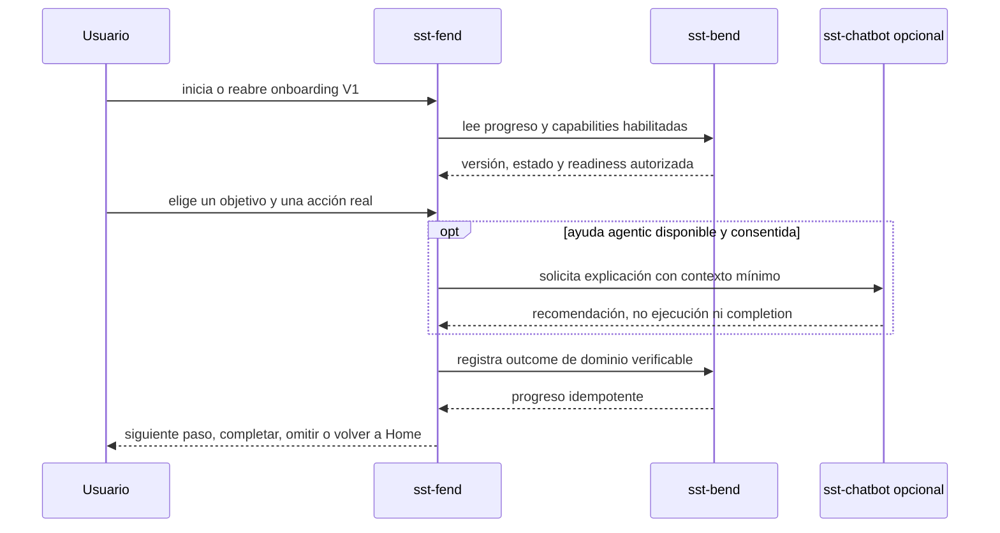

# Recomendación para un onboarding evolutivo de SST

## Rol, estado y autoridad

- Rol primario: análisis de alternativas y playbook de decisión.
- Owner: `4uentes-orchestor` para coordinación; cada repo funcional conserva la autoridad de sus contratos.
- Estado: propuesta, no autoriza implementación ni reserva identidades nuevas.
- Fuentes: `CR-SST-0238`, `CR-SST-0241`, `INIT-SST-0007`, `INIT-SST-0009`, `INIT-SST-0010`, estados de Chat, Learning, memoria y procesamiento agentic, y contratos owner observados.
- Runbook: no aplica hasta seleccionar y publicar el contrato; una ejecución futura deberá crear su propio runbook.

## Decisión recomendada

Adoptar un onboarding híbrido, progresivo, versionado, saltable y reabrible. `/onboard` será un hub autenticado breve; las acciones útiles sucederán en las superficies reales. Una state machine determinista y el estado canónico de SST validarán el progreso. El chatbot podrá explicar y recomendar, pero no completar pasos, conceder permisos, aceptar memoria ni ejecutar acciones por sí mismo.

El primer onboarding es la experiencia existente y se rotula `V0`:

```text
Landing pública -> login o registro -> defaultModule/Home
```

`CR-SST-0238` debe estabilizar primero esa entrada. La futura ruta `/onboard` se reintroducirá únicamente cuando posea contrato, pantalla, estado y fallback reales.

## Alternativas analizadas

| Alternativa | Ventaja | Límite | Decisión |
| --- | --- | --- | --- |
| Wizard fijo en `/onboard` | Implementación y medición simples | Se vuelve obsoleto y bloquea si una capability falla | Descartada como solución completa |
| Checklist sólo en Home | Baja fricción y buen fallback | Orientación inicial débil y poca personalización | Conservar como componente |
| Hub híbrido más checklist y ayuda contextual | Evoluciona por versión y usa superficies reales | Exige estado, readiness, métricas y degradación bien definidos | Recomendada |
| Chatbot-first | Conversación flexible | Dependencia del agente, accesibilidad desigual y riesgo de capacidades aparentes | Diferida; nunca será el único camino |

## Recorrido y boundaries

<!-- visual-map:start -->

```yaml
visual_map:
  schema_version: "1.0"
  id: "sst-evolutionary-onboarding-v1"
  type: "sequence"
  question: "¿Cómo llega un usuario a su primera utilidad sin delegar autoridad al chatbot?"
  abstraction_level: "Recorrido de producto y límites lógicos, no endpoints ni diseño físico."
  source_refs:
    - "requests/running/CR-SST-0238-reconcile-authenticated-entry-and-react-compatibility.yaml"
    - "initiatives/INIT-SST-0007-sst-chatbot-first-connected-version.yaml"
    - "initiatives/INIT-SST-0010-personal-knowledge-and-memory-workspace.yaml"
  request_ids: []
  observed_at: "2026-09-07"
  authority_boundary: "Vista derivada; Fend, Bend, Auth y Chatbot conservan autoridad sobre sus contratos owner."
  textual_fallback_required: true
```



### Fallback textual

```text
El usuario inicia o reabre una versión del onboarding. Fend consulta a Bend el progreso y la readiness autorizada, muestra sólo capabilities disponibles y deja elegir un objetivo. La acción ocurre en el módulo real. Chatbot puede explicar con consentimiento y contexto mínimo, pero no ejecuta ni marca completion. Bend registra un outcome verificable e idempotente. Si Chatbot o una capability fallan, el flujo determinista permite reintentar, hacer después, omitir o volver a Home.
```

<!-- visual-map:end -->

## Evolución propuesta

### V0 — entrada actual estabilizada

- Landing pública informativa.
- Login o registro.
- Entrada segura a `defaultModule/Home` bajo `CR-SST-0238`.
- No hay progreso persistente ni `/onboard` artificial.

### V1 — primera utilidad determinista

- `/onboard` autenticado, breve, reabrible y saltable.
- Elección de un solo objetivo inicial.
- Mostrar únicamente módulos con readiness verificable en el ambiente.
- Completar por un outcome del dominio, no por visitar una ruta.
- Checklist resumido en Home y acceso permanente para repetir el recorrido.
- Chatbot limitado a ayuda general read-only si su health y feature gate pasan.

Objetivos candidatos, sujetos a readiness:

- consultar: abrir efectivamente un artículo disponible;
- crear: guardar un primer borrador o artículo mediante el flujo real;
- aprender: completar preview y aceptación explícita de contexto cuando Learning esté publicado y validado;
- preguntar: recibir una respuesta completa en un chat temporal, sin guardar conversación ni memoria automáticamente.

### V2 — ayuda contextual agentic

- Chatbot pregunta la intención y recomienda el siguiente paso.
- Ayuda contextual en Articles, Learning y Chat.
- Fallo del agente degrada al recorrido estático sin simular respuestas.
- Toda selección de contenido para el agente es explícita y scope-validada.

### V3 — propuestas confirmables

- El agente puede preparar una propuesta o preview.
- La aplicación exige confirmación, idempotency key y receipt antes de cualquier operación.
- El agente no determina completion: el outcome owner lo determina.
- Procesamiento agentic de artículos entra sólo después de que su pipeline, UX y E2E estén publicados.

### V4 — personalización mediante memoria aceptada

- Personalizar solamente con memoria canónica que el usuario aceptó.
- Revisar, exportar y eliminar deben estar disponibles antes del rollout.
- Guardar conversación, proponer memoria y aceptar memoria permanecen decisiones distintas.
- Automatización autónoma queda fuera de alcance y requiere lifecycle de seguridad separado.

## Estado canónico sugerido

`firstLogin` de Auth es una señal de sesión, no la autoridad del onboarding. Si se aprueba sincronización entre dispositivos, `sst-bend` debería poseer un estado mínimo como:

```text
journey_version
status: not_started | in_progress | skipped | completed
selected_goal
completed_step_ids
started_at | updated_at | completed_at
```

Una versión nueva no debe invalidar completions anteriores ni forzar automáticamente el recorrido completo. La política de reaparición necesita decisión humana. `4uentes-auth` permanece como autenticación/BFF relay y no como owner del progreso de producto.

## Niveles de asistencia agentic

| Nivel | Capacidad | Boundary |
| --- | --- | --- |
| L0 | Recorrido estático | Sin datos del usuario ni dependencia del modelo |
| L1 | Explicaciones generales de SST | Read-only, contexto mínimo y sin handoff |
| L2 | Ayuda sobre un recurso elegido | Scope validado y contenido seleccionado explícitamente |
| L3 | Propuesta de operación | Preview, confirmación, idempotencia y receipt |
| L4 | Personalización | Sólo memoria aceptada, revisable y eliminable |
| L5 | Ejecución autónoma | Fuera de alcance |

V1 usa L0 y opcionalmente L1. La temperatura `0.3` puede evaluarse como parámetro del proveedor para respuestas consistentes, pero no es un control de autorización o seguridad. El runtime de esta sesión no expone un control verificable de temperatura, por lo que no se declara aplicada.

## Consentimiento, privacidad y telemetría

- Separar progreso funcional de analytics opcional.
- Pedir consentimiento contextual independiente para enviar contenido, guardar chat, proponer memoria, aceptar memoria o usar un proveedor externo.
- No enviar a analytics prompts, mensajes, títulos, artículos, respuestas, emails, URLs privadas, tenant/user IDs ni tokens.
- Eventos permitidos candidatos: `onboarding_started`, `goal_selected`, `step_completed`, `step_skipped`, `onboarding_completed`, `onboarding_skipped`, capability disponible/no disponible, outcome y latencia por bucket.
- Usar IDs opacos, versión y códigos controlados; retención y finalidad requieren aprobación humana.

## Métricas de producto y calidad

- Activación por objetivo mediante outcome owner exitoso.
- Tiempo a primera utilidad p50/p90.
- Inicio, abandono, omisión y completion por paso, versión y cohorte.
- Error e indisponibilidad por capability.
- Retorno a siete días y siguiente acción posterior.
- Paridad de completion por teclado, touch, mobile y reduced motion.
- En Chat medir respuesta completada, nunca su contenido.

## Programa ARDS/SDD recomendado

Crear una Initiative SST nueva después de un preflight global. `INIT-SST-0009` conserva QA/defectos y `INIT-SST-0010` memoria/conocimiento; ambas pueden aportar dependencias, pero ninguna debe absorber esta experiencia transversal.

Unidades futuras, sin IDs reservados:

1. Decisión/coordinación de producto: audiencia, activación, versionado, skip/replay, privacidad, telemetría, readiness y owner map.
2. Contrato cross-repo del journey y su state model, sin mutar owners.
3. `sst-bend`: progreso canónico, versión e idempotencia, si se aprueba persistencia durable.
4. `4uentes-auth`: relay BFF mínimo sólo si el contrato lo necesita.
5. `sst-fend`: spec/docs, `/onboard`, Home checklist, gating, accesibilidad y pruebas.
6. `sst-chatbot`: guía contextual, guardrails, fallback y evals; sin authority sobre progreso.
7. Observabilidad privada y política de retención.
8. Infra: únicamente feature flags o manifests necesarios.
9. QA E2E integrada, rollout por cohorte y evidencia terminal.

Cada unidad tendrá inbox, plan publicado/readback, running autorizado, owner docs, checks owner y evidencia. Jira será mirror: Initiative a Epic, coordinación a Task y slices dependientes a Subtasks, mediante un batch exacto autorizado después del lifecycle local.

## Dependencias y gates

- Cerrar `CR-SST-0238` antes de reintroducir `/onboard`.
- Completar `CR-SST-0241` antes de aceptar QA Compose local como equivalente al release `raw-v2`; es dependencia operativa, no funcional.
- Consumir el contrato vigente de sesión sin redefinir auth.
- No mostrar Chat, Learning, memoria o procesos agentic como obligatorios hasta que su estado efectivo del ambiente esté publicado y validado.
- Ejecutar checks completos de cada owner y `npm run check` del control-plane antes del cierre.
- Probar usuario nuevo, usuario existente, omitido, reanudado, versión posterior, múltiples pestañas/dispositivos, refresh, errores de red y agente no disponible.
- QA accesible: foco predecible, headings, `aria-live`, progreso no dependiente de color, targets de 44 px, teclado, mobile y `prefers-reduced-motion`.

## Rollout, stop conditions y rollback

Rollout recomendado: feature flag apagado por defecto, cohorte interna, luego usuarios nuevos y expansión basada en evidencia.

Detener si:

- una capability mostrada no tiene readiness verificable;
- el agente es requisito para completar;
- el flujo accede a contenido sin selección o consentimiento;
- analytics necesita contenido o identidad directa;
- owner docs, aislamiento, auth, accesibilidad o checks fallan.

Rollback: apagar el flag y volver a Home/defaultModule sin borrar progreso. Las migraciones deben ser aditivas y compatibles. El fallback debe permitir completar la tarea real fuera del onboarding.

## Decisiones humanas pendientes

1. Audiencia inicial: sólo cuentas nuevas, también existentes o cohortes seleccionadas.
2. Entrada: `/onboard` automático o invitación visible en Home.
3. Activación: una meta elegida o varias capacidades obligatorias.
4. Persistencia, retención y sincronización entre dispositivos.
5. Reaparición y compatibilidad entre versiones.
6. Capabilities suficientemente maduras para V1.
7. Eventos analíticos, finalidad y retención autorizada.
8. Grado máximo de asistencia del chatbot; para V1 se recomienda sólo L1.

## Delegación y selección de modelo

La tarea se clasificó `long-context-task` con riesgo alto en boundaries agentic y de auth. Recursos `normal/default`; perfil de policy `gpt-5.6-sol` con razonamiento alto para discovery y máximo para la integración principal; fallback `gpt-5.4-fast-high high` para contexto largo, sin degradar decisiones sensibles.

Se delegaron tres lecturas acotadas y read-only: UX, participación agentic y governance. Cada una declaró inputs, output, riesgo y validación. La decisión, integración y boundaries permanecieron en el agente principal. Los resultados fueron contrastados con los archivos owner y del control-plane antes de incorporarse.
