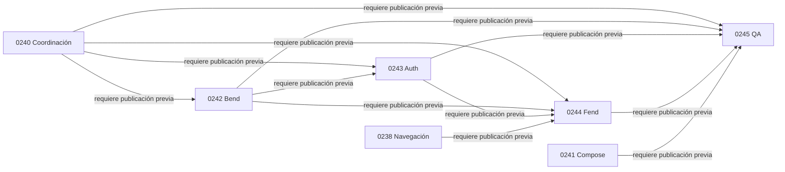

# Binding owner y slices del onboarding

Fecha: 2026-09-08. Owner: `4uentes-orchestor`. Rol: plan de coordinación.
Estado: planes para publicación; no ejecución funcional autorizada.
Fuente: contrato V1 de CR-SST-0240 y fuentes owner enumeradas abajo.
Este playbook enlaza el contrato directamente. Cada slice publicará su runbook
antes de operar runtime, con ambiente, revisiones y cleanup resueltos.

## Preflight y autorización

Se refrescó `origin/main`, sin avance respecto a `f2a147d`. Se reutilizó el
worktree limpio del coordinador con branch de continuación. Las policies
vigentes mantienen ownership, modelos y gates registrados. Sin subagentes ni
cambio de modelo del runtime.

CR-SST-0242 a CR-SST-0245 no aparecen en historia de archivos de refs Git,
requests de worktrees registrados ni PRs. JQL devolvió cero coincidencias con
paginación completa para cada candidato antes de crear los artefactos:
`owner-slice-jql-preflight.json`. La reserva es canónica sólo después del merge.

La continuación del usuario autoriza este avance documental y su publicación.
El lote Jira previo está consumido: no se reutiliza. Cada slice propone una
Subtask bajo SST-128 y Epic SST-127; su creación requiere un lote nuevo exacto.
Estos planes no habilitan mutación owner, contenedores, despliegues o cohortes.

## Fuentes y binding observado

Bend: `specs/capabilities/outbound/article-text-ingestion.yaml`,
`src/apps/sst/application/articulos/create-articulo.usecase.js`,
`src/apps/sst/infrastructure/db/postgres/articulos/sequelize-articulos.repository.js`
y `specs/api/auth.yaml`. Código revisado desde la ref local
`origin/develop@fdc753ff0bf96e8b8b5f603a9aae11503aa2ace1`; el checkout con
cambios ajenos no se usa como evidencia de publicación.

La capability publica `POST /4uentes/v1/articulos` con `payload.kind=text`,
201 y artículo/payload/filtro persistidos. El use case los crea en transacción.
`findById` sólo aplica `accountId` si se proporciona: el verificador deberá
pasarlo siempre. La pertenencia a la cuenta no prueba el actor creador.

Auth: `specs/capabilities/outbound/article-text-ingestion.yaml` y
`specs/integrations-api.yaml`, leídas también desde
`origin/develop@ff5605c67d412e3e363d58de14a5b6b98b38c4ad`. El facade principal
es `/api/articles`, con `/api/articulos` como alias. `X-Correlation-Id` está
documentado para Chat; el nuevo relay requiere adopción explícita.
El inbound Fend `specs/capabilities/inbound/node-auth--article-text-ingestion.yaml`
documenta adopción del alta de texto. `node-auth` en filenames es histórico;
el owner lógico continúa siendo `4uentes-auth`.

Estas refs son evidencia local de discovery, no una certificación del HEAD
remoto actual. Cada slice debe refrescar y reconciliar su owner antes de ejecutar.

## Decisiones y gaps

- V1 concreta `article_saved` como alta de texto nativo por el flujo general;
  no requiere URL, PDF, extensión ni procesamiento agentic.
- `resourceRef` identifica el artículo persistido devuelto por el create, sin
  contenido ni título; no se copia a telemetría, Jira o evidencia.
- Bend debe publicar prueba de actor e intento generada por el servidor y
  ligada al resultado real. Cuenta compartida, timestamp reciente o afirmación
  del browser no bastan. Si falta esa prueba, el slice diseñará un recibo
  mínimo owner antes de aceptar activación.
- Se propone `X-Correlation-Id` junto con `Idempotency-Key`; los owners deberán
  publicar soporte en onboarding, sin inferirlo de Chat.
- Retención, replay, deduplicación y eliminación siguen como decisiones del
  contrato Bend antes de implementar. Readiness permanece cerrada hasta pasar
  esos gates; no se inventa una ventana arbitraria desde el control plane.

## Unidades

| CR | Owner | Entregable |
| --- | --- | --- |
| CR-SST-0242 | sst-bend | Estado durable y resultado Articles verificable |
| CR-SST-0243 | 4uentes-auth | Relay sin autoridad de progreso |
| CR-SST-0244 | sst-fend | Hub e invitación reanudables y accesibles |
| CR-SST-0245 | Control plane | QA integrado y readiness para rollout |

<!-- visual-map:start -->

```yaml
visual_map:
  schema_version: "1.0"
  id: "sst-onboarding-owner-slice-order"
  type: "dependency"
  question: "¿Qué predecesor habilita el siguiente slice del onboarding?"
  abstraction_level: "Requests del control plane"
  source_refs:
    - "requests/planned/CR-SST-0242-implement-durable-onboarding-and-verified-article-outcomes.yaml"
    - "requests/planned/CR-SST-0243-relay-onboarding-v1-through-auth-bff.yaml"
    - "requests/planned/CR-SST-0244-implement-onboarding-hub-and-home-invitation.yaml"
    - "requests/planned/CR-SST-0245-validate-integrated-onboarding-and-rollout-readiness.yaml"
  observed_at: "2026-09-08"
  authority_boundary: "Vista derivada; los requests ARDS/SDD conservan autoridad sobre dependencias y gates."
  textual_fallback_required: true
```



### Fallback textual

```text
Cada flecha va del predecesor al dependiente. 0240 precede a 0242, 0243,
0244 y 0245. 0242 precede a 0243, 0244 y 0245. 0243 precede a 0244 y
0245. 0238 precede a 0244. 0244 y 0241 preceden a 0245.
```

<!-- visual-map:end -->

## Validación y siguiente gate

Baseline: check completo pasó, 49 documentos, 63 mapas, 0 FAIL. La revisión
cubre actor distinto en la misma cuenta, replay histórico, fallas y
concurrencia. No son pruebas runtime. Después del merge/readback de estos
planes, corresponde enumerar el lote Bend con prueba de actor/intento y
retención explícitas y el lote Jira nuevo. Coordinador running; feature planned.

Validación del lote: `npm.cmd run check` completo pasó con exit 0,
50 documentos, 64 mapas y 0 FAIL, incluyendo owner documentation.
Se corrigieron etiquetas explícitas de dependencia requeridas por el gate visual.
No se alteraron validadores ni se ejecutaron fixes en owners.
