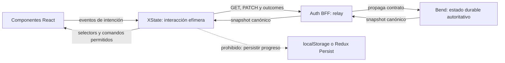
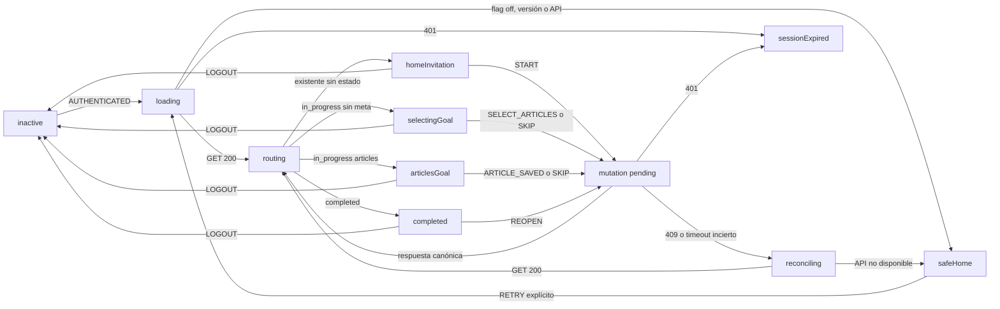
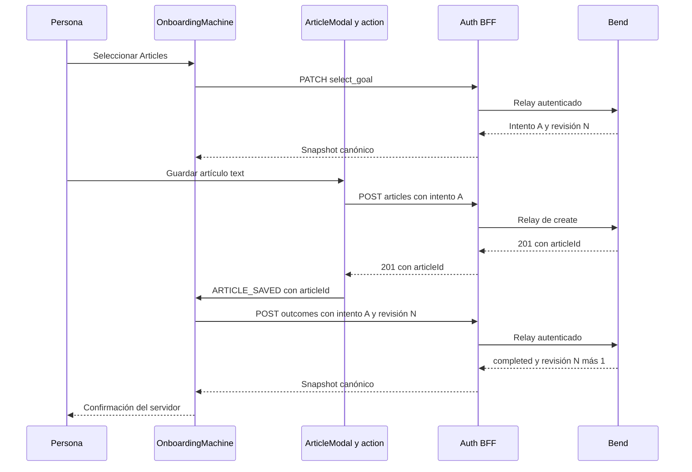

# Arquitectura XState para el onboarding en sst-fend

Fecha: 2026-09-11. Request: `CR-SST-0244`. Iniciativa: `INIT-SST-0011`.
Owner funcional: `sst-fend`. Estado: diseño aceptado y lote preparado; el
request permanece `planned` porque todavía no se publicó el relay de
`CR-SST-0243`.

El usuario aceptó adoptar en el frontend el diseño de máquina de estados y
pidió integrarlo con XState y el sistema de machines existente. Este documento
convierte esa decisión en una arquitectura ejecutable. No autoriza saltar las
dependencias ni modifica todavía el repo funcional.

Fuentes observadas:

- Control plane `main@384a4b59b21d07266d0977cbd5ded2d2216f755c`.
- `sst-fend:develop@bd9b8d2aa52aab2346b7bf94b0db05ed188c09a3`.
- `sst-bend:develop@cbb2222bb3a0898be328dc4e6765eb72f853745e`.
- `CR-SST-0243` planned con gate Auth publicado y pendiente de aprobación.

## Decisión de arquitectura

Se creará una `OnboardingMachine` dedicada con XState v5, `setup`, actors
basados en promesas, guards y actions tipadas. No se reutilizará
`StepperMachine`: esa máquina administra un índice y datos locales de pasos;
onboarding debe rehidratar estado remoto, conservar una clave durante reintentos,
resolver conflictos y degradar de manera segura.

La máquina frontend no replica la autoridad de Bend. Su contexto conserva una
proyección efímera de la respuesta canónica: `journeyVersion`, `status`,
`selectedGoal`, `attemptId`, `revision`, readiness y timestamps necesarios para
presentar la experiencia. No persiste progreso en Redux Persist, localStorage,
URL o cookies. Tras refresh vuelve a ejecutar GET.

El backend decide `not_started | in_progress | skipped | completed`. XState
decide estados de interacción como loading, submitting, conflict y safe Home.
El frontend nunca envía `status` ni inventa completion.

<!-- visual-map:start -->

```yaml
visual_map:
  schema_version: "1.0"
  id: "sst-onboarding-backend-frontend-state-authority"
  type: "dependency"
  question: "¿Qué estado controla Bend y qué estado controla XState en el frontend?"
  abstraction_level: "Autoridad de estado por componente lógico"
  source_refs:
    - "evidence/requests/CR-SST-0240/onboarding-v1-contract.yaml"
    - "requests/planned/CR-SST-0244-implement-onboarding-hub-and-home-invitation.yaml"
    - "evidence/requests/CR-SST-0242/owner-integration-readback-2026-09-10.md"
  observed_at: "2026-09-11"
  authority_boundary: "Vista derivada; los contratos owner de Bend, Auth y Fend conservan autoridad técnica."
  textual_fallback_required: true
```



### Fallback textual

```text
React envía intenciones a XState. XState coordina llamadas al BFF. El BFF relaya
el contrato a Bend. Bend guarda y devuelve el estado canónico; la respuesta
regresa a XState y sus selectors alimentan React. XState no persiste progreso
en localStorage ni Redux Persist.
```

<!-- visual-map:end -->

## Máquina propuesta

El actor se activa únicamente después de que `ActorProvider` confirme sesión
autenticada. `OnboardingMachineProvider` vivirá dentro de ese provider y por
encima de las rutas protegidas para sobrevivir a navegación entre `/onboard`,
Home y Articles. Logout detiene o resetea el actor y borra su contexto efímero.
Un flag frontend apagado evita montar/activar el actor, oculta invitaciones y
resuelve `/onboard` hacia Home. El nombre y la forma exacta del flag se fijarán
en la spec owner y `.env.example`; su default debe ser off.

Estados de interacción propuestos:

| Estado XState | Propósito |
| --- | --- |
| `inactive` | No hay sesión autenticada; no llama al onboarding |
| `loading` | Ejecuta GET y espera el snapshot canónico |
| `routing` | Clasifica snapshot y señal inicial sin efectos remotos |
| `homeInvitation` | Usuario existente sin estado: Home ofrece comenzar |
| `selectingGoal` | Intento activo sin meta: `/onboard` muestra metas ready |
| `articlesGoal` | Intento activo con Articles: explica y habilita create text |
| `starting`, `selecting`, `skipping`, `reopening`, `completing` | Una mutación en vuelo; bloquea doble submit |
| `reconciling` | Tras 409 o resultado desconocido vuelve a GET |
| `completed` | Presenta resultado confirmado; ofrece Home o reopen |
| `safeHome` | Flag off, versión no soportada o API no disponible; sin loop |
| `sessionExpired` | Delega al flujo de recuperación de Auth |

`skipped` no necesita una pantalla forzada: su proyección normal es Home con
entrada permanente para reabrir. Si el usuario visita `/onboard` explícitamente,
la UI ofrece `reopen`; no lo ejecuta automáticamente.

<!-- visual-map:start -->

```yaml
visual_map:
  schema_version: "1.0"
  id: "sst-onboarding-xstate-interaction-lifecycle"
  type: "lifecycle"
  question: "¿Cómo coordina XState carga, acciones, reconciliación y fallback?"
  abstraction_level: "Estados de interacción de OnboardingMachine"
  source_refs:
    - "evidence/requests/CR-SST-0244/xstate-architecture-and-execution-plan-2026-09-11.md"
    - "evidence/requests/CR-SST-0240/onboarding-v1-contract.yaml"
  observed_at: "2026-09-11"
  authority_boundary: "Vista derivada de diseño no implementado; CR-SST-0244 gobierna el plan y el futuro spec owner de sst-fend será la autoridad técnica."
  textual_fallback_required: true
```



### Fallback textual

```text
Sin sesión la máquina está inactive. AUTHENTICATED inicia GET en loading.
Una respuesta válida pasa por routing hacia invitación Home, selección de meta,
meta Articles o completed. Las intenciones válidas pasan por mutation pending y
vuelven a routing con la respuesta canónica. 409 o timeout incierto conducen a
reconciling y GET. Flag off, versión no soportada o API caída conducen a safeHome;
sólo un retry explícito vuelve a loading. 401 delega a sessionExpired. Logout
resetea el actor.
```

<!-- visual-map:end -->

## Eventos y efectos

Eventos públicos: `AUTHENTICATED`, `LOGOUT`, `START`, `SELECT_ARTICLES`, `SKIP`,
`REOPEN`, `ARTICLE_SAVED`, `REFRESH`, `RETRY`, `ENTER_ONBOARD` y
`DISMISS_INVITATION`. El dismissal vive sólo en el actor actual: no altera el
estado remoto y la entrada permanente de Home sigue disponible.

- `START` usa la revisión canónica y una nueva Idempotency-Key.
- `SELECT_ARTICLES`, `SKIP` y `REOPEN` siguen la misma regla.
- La clave se crea una vez por intención y permanece en contexto mientras el
  resultado sea desconocido. Un retry de esa intención reutiliza la clave.
- Una intención humana nueva genera otra clave.
- `ARTICLE_SAVED` sólo se acepta si el create devolvió un ID válido, la máquina
  conserva el mismo `attemptId`, la meta actual es Articles y no hay completion
  en vuelo. Entonces el actor llama outcomes.
- Un 409 descarta la intención automática y hace GET; la UI presenta el estado
  resultante y permite que la persona decida otra vez.
- Un timeout es resultado desconocido: retry con la misma key o GET. No muestra
  completion optimista.

La máquina escuchará `visibilitychange`/focus mediante el provider para enviar
`REFRESH`. Esto permite convergencia entre pestañas sin compartir progreso en
almacenamiento local. Las respuestas viejas no sobreescriben snapshots con una
revisión superior. No se agregará polling continuo en V1.

## Registro nuevo y usuario existente

`firstLogin` o la señal equivalente de Auth se usa sólo como trigger inicial.
Después de AUTHENTICATED la máquina ejecuta GET. Si la respuesta es ausencia y
la sesión proviene de un registro recién confirmado, envía `start` una vez y
navega a `/onboard` sólo tras éxito durable. Si falla, va a Home sin loop.

Para un usuario existente con ausencia, GET lleva a `homeInvitation`: se queda
en Home y comienza únicamente al aceptar la invitación. `firstLogin` no se
guarda como progreso ni gana frente a una respuesta durable existente.

## Integración con Articles

El contexto expone un selector `activeArticleAttemptId`: UUID sólo cuando el
snapshot es `in_progress`, la meta es `articles` y readiness la permite.
El create nativo de texto agrega opcionalmente ese valor como
`onboardingAttemptId`. Web, transcript, update y create fuera de un intento
activo conservan el payload actual.

`ArticleModal` seguirá usando `createArticuloAction`; no se duplicará el CRUD en
la máquina. Después de un create text exitoso con ID válido, notifica
`ARTICLE_SAVED`. La máquina ejecuta outcomes. Un error de create no envía evento
y no completa. Cerrar el modal después del 201 no pierde la verificación: el
actor sigue vivo en el provider.

<!-- visual-map:start -->

```yaml
visual_map:
  schema_version: "1.0"
  id: "sst-onboarding-xstate-article-result-sequence"
  type: "sequence"
  question: "¿Cómo convierte el frontend un create text real en completion confirmado?"
  abstraction_level: "Componentes y actores frontend con sus llamadas BFF"
  source_refs:
    - "evidence/requests/CR-SST-0244/xstate-architecture-and-execution-plan-2026-09-11.md"
    - "evidence/requests/CR-SST-0243/execution-gate-2026-09-10.md"
    - "evidence/requests/CR-SST-0242/owner-integration-readback-2026-09-10.md"
  observed_at: "2026-09-11"
  authority_boundary: "Vista derivada de integración propuesta; los contratos owner publicados conservan autoridad."
  textual_fallback_required: true
```



### Fallback textual

```text
La persona selecciona Articles; XState envía PATCH y recibe intento A/revisión N.
ArticleModal crea texto mediante el BFF incluyendo intento A. Bend devuelve 201
con articleId. ArticleModal notifica ARTICLE_SAVED a XState. XState envía outcomes
con intento A, articleId y revisión N. Sólo la respuesta completed del servidor
permite mostrar completion.
```

<!-- visual-map:end -->

## Superficies owner previstas

- `specs/39-onboarding-frontend.yml` y su índice: autoridad frontend de estados
  de interacción, entry, fallback, accesibilidad y privacidad.
- `specs/capabilities/inbound/node-auth--onboarding-v1.yaml` y los índices.
- `docs/39-onboarding-frontend.md`, doc inbound y task report CR-SST-0244.
- `src/services/onboardingService.ts`: DTOs y cliente HTTP tipado, sin UI.
- `src/machines/OnboardingMachine/`: machine, tipos, actors, guards y actions.
- `src/context/OnboardingMachineContext.tsx`, provider y hook de consumo.
- `src/App/routes.tsx`: ruta protegida `/onboard` y provider autenticado.
- `.env.example` y wiring Webpack del flag frontend, sólo si el mecanismo
  existente no expone todavía una variable apropiada.
- `src/pages/Onboard/`: hub accesible y reanudable.
- Home: invitación descartable visualmente y entrada permanente para reabrir.
- `src/services/articuloService.ts`, mapper de create y `ArticleModal`: metadata
  opcional y notificación del resultado real.
- Locales ES/EN y tipos CSS Modules generados.

No se añadirá otra dependencia: `xstate ^5.20.0` y `@xstate/react ^4.1.3` ya
están en el owner. `StepperMachine`, `ArticlesModalMachine` y `AuthMachine`
permanecen independientes; sólo comparten convenciones XState v5.

## Pruebas y stop conditions

Pruebas puras con `createActor`: cada estado/evento válido e inválido; no-op;
clave estable en retry; nueva clave por intención; routing de snapshots; 409 y
timeout hacia refetch; rechazo de respuesta con versión desconocida; logout.

Pruebas de integración React: registro nuevo; existente sin estado; resume;
skip/reopen; refresh; focus; múltiples respuestas fuera de orden; fallback Home
sin loop; 401; flag off; Learning/Chat ocultos; navegación y foco restaurado.

Pruebas Articles: metadata sólo en text con intento activo; ausencia mantiene el
request exacto; fallo no envía outcome; 201 inválido no envía outcome; 201 válido
envía una vez; 409/outcome timeout no inventan completion; cierre del modal no
mata el actor. Accesibilidad: teclado, labels, foco, contraste, móvil y
`prefers-reduced-motion`.

Ejecutar `npm run check` owner y el control plane completo. La QA browser/HTTP
integrada pertenece a CR-SST-0245; los tests mock no prueban runtime desplegado.

Detener si:

- Auth no publicó su capability outbound o descarta `onboardingAttemptId`;
- el frontend intenta persistir progreso o aceptar `status` del cliente;
- completion se muestra antes de la respuesta canónica;
- se crea un cliente HTTP ad hoc desde componentes;
- se mezclan responsabilidades de AuthMachine, StepperMachine y OnboardingMachine;
- el flag deja de estar off o aparece un redirect loop;
- fallan specs, docs, tests, lint o build.

## Orden de ejecución

1. Completar y leer canónicamente CR-SST-0243, incluido el metadata de Articles.
2. Repetir preflight de `sst-fend:develop`, branch/PR y Jira.
3. Publicar `CR-SST-0244` running con un lote exacto y crear worktree limpio.
4. Implementar primero spec, DTO/service y máquina pura; validar paths.
5. Integrar provider, `/onboard`, Home y Articles; validar componentes.
6. Publicar PR owner sin merge ni despliegue, leer checks y registrar evidencia.
7. Usar otro gate para integración owner y luego CR-SST-0245 para QA/rollout.

El próximo gate de ejecución sigue siendo CR-SST-0243. La aceptación del diseño
XState no autoriza implícitamente mutaciones Auth, Jira, Fend, Infra o runtime.

La policy owner exige revisión especializada para esta clasificación. Se lanzó
un reviewer read-only de arquitectura e impacto cross-repo, pero no entregó un
resultado dentro de la ventana de planificación. Se aplicó el fallback previsto:
revisión secuencial por el agente principal contra `origin/develop`, contrato y
dependencias. El gate running deberá repetir la revisión especializada sobre el
diff refrescado antes de permitir mutación de `sst-fend`.
