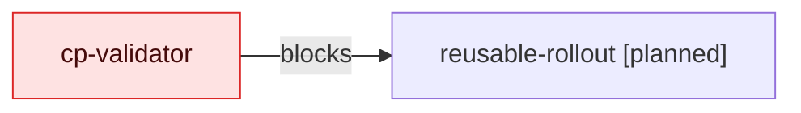

## Color-Only Status Fixture

<!-- visual-map:start -->
```yaml
visual_map:
  schema_version: "1.0"
  id: "color-only-status-fixture"
  type: "lifecycle"
  question: "¿Qué node depende solamente de color para indicar bloqueo?"
  abstraction_level: "Adoption gate."
  source_refs:
    - "state/features/visual-documentation-as-code-adoption.current.yaml"
  observed_at: "2026-08-15"
  authority_boundary: "Vista derivada; el state conserva autoridad."
  textual_fallback_required: true
```

## Fallback Textual
```text
cp-validator blocks reusable-rollout.
```
<!-- visual-map:end -->
