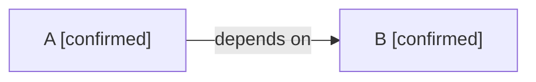

## Missing Fallback Fixture

<!-- visual-map:start -->
```yaml
visual_map:
  schema_version: "1.0"
  id: "missing-fallback-fixture"
  type: "dependency"
  question: "¿Qué mapa omite su fallback textual?"
  abstraction_level: "Change request lifecycle."
  source_refs:
    - "requests/planned/CR-SST-0180-integrate-login-sessions-and-timeout-corrections.yaml"
  observed_at: "2026-08-15"
  authority_boundary: "Vista derivada; el lifecycle conserva autoridad."
  textual_fallback_required: true
```

<!-- visual-map:end -->
