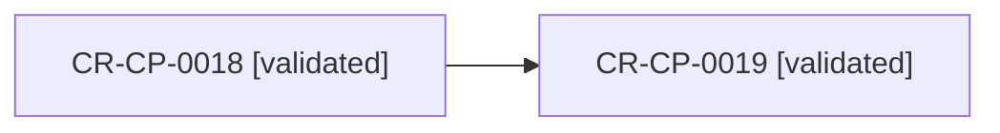

## Unlabeled Edge Fixture

<!-- visual-map:start -->
```yaml
visual_map:
  schema_version: "1.0"
  id: "unlabeled-edge-fixture"
  type: "dependency"
  question: "¿Qué dependency carece de label textual?"
  abstraction_level: "Change request lifecycle."
  source_refs:
    - "requests/planned/CR-CP-0018-define-visual-documentation-as-code-profile.yaml"
    - "requests/planned/CR-CP-0019-implement-visual-documentation-quality-gate.yaml"
  observed_at: "2026-08-15"
  authority_boundary: "Vista derivada; el lifecycle conserva autoridad."
  textual_fallback_required: true
```

## Fallback Textual
```text
CR-CP-0018 precedes CR-CP-0019.
```
<!-- visual-map:end -->
