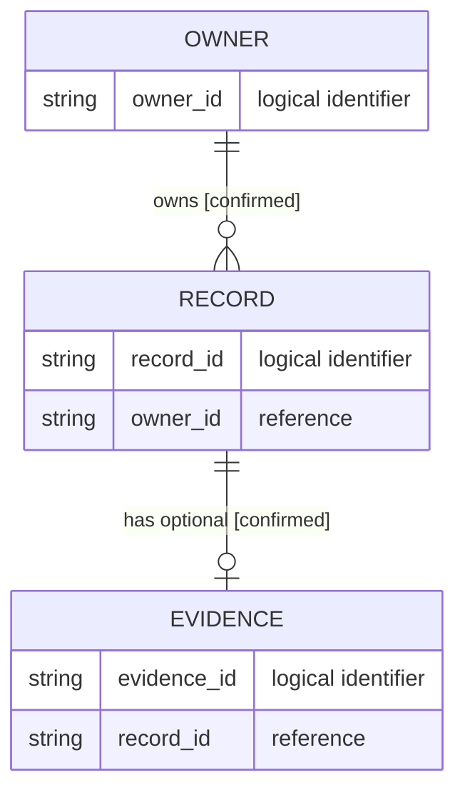

# Template De Mapa De Datos Lógicos

<!-- visual-map:start -->

```yaml
visual_map:
  schema_version: "1.0"
  id: "TODO-data-map-id"
  type: "data"
  question: "TODO: ¿cómo se relacionan estas entidades lógicas?"
  abstraction_level: "TODO: logical entity o contract field group"
  source_refs:
    - "TODO/repo-relative-data-contract.yaml"
  observed_at: "TODO-YYYY-MM-DD"
  authority_boundary: "Vista derivada sin valores; TODO/contract conserva autoridad."
  textual_fallback_required: true
```



## Fallback Textual Del Mapa De Datos

```text
One OWNER owns zero or more RECORD entries.
One RECORD has zero or one EVIDENCE entry.
Only logical identifiers are shown; no production values are included.
```

<!-- visual-map:end -->
