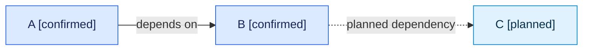

# Template De Mapa De Dependencias

<!-- visual-map:start -->

```yaml
visual_map:
  schema_version: "1.0"
  id: "TODO-dependency-map-id"
  type: "dependency"
  question: "TODO: ¿qué depende de qué y en qué dirección?"
  abstraction_level: "TODO: service, repository o request"
  source_refs:
    - "TODO/repo-relative-source.yaml"
  observed_at: "TODO-YYYY-MM-DD"
  authority_boundary: "Vista derivada; TODO/source conserva autoridad."
  textual_fallback_required: true
```



## Fallback Textual Del Mapa De Dependencias

```text
A [confirmed] depends on B [confirmed].
B has a planned dependency on C [planned].
```

<!-- visual-map:end -->
