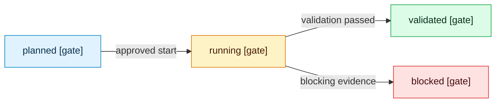

# Template De Mapa De Lifecycle

<!-- visual-map:start -->

```yaml
visual_map:
  schema_version: "1.0"
  id: "TODO-lifecycle-map-id"
  type: "lifecycle"
  question: "TODO: ¿qué gate o estado debe completarse antes del siguiente?"
  abstraction_level: "TODO: request lifecycle o adoption gate"
  source_refs:
    - "TODO/repo-relative-lifecycle.yaml"
  observed_at: "TODO-YYYY-MM-DD"
  authority_boundary: "Vista derivada; TODO/lifecycle conserva autoridad."
  textual_fallback_required: true
```



## Fallback Textual Del Mapa De Lifecycle

```text
planned --approved start--> running
running --validation passed--> validated
running --blocking evidence--> blocked
```

<!-- visual-map:end -->
