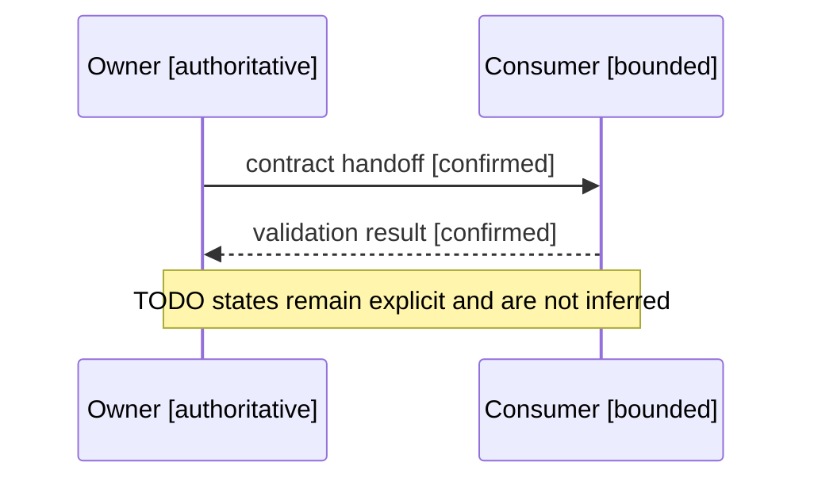

# Template De Mapa De Secuencia

<!-- visual-map:start -->

```yaml
visual_map:
  schema_version: "1.0"
  id: "TODO-sequence-map-id"
  type: "sequence"
  question: "TODO: ¿en qué orden intercambian acciones estos participantes?"
  abstraction_level: "TODO: cross-repo handoff o request execution"
  source_refs:
    - "TODO/repo-relative-contract.yaml"
  observed_at: "TODO-YYYY-MM-DD"
  authority_boundary: "Vista derivada; TODO/contract conserva autoridad."
  textual_fallback_required: true
```



## Fallback Textual Del Mapa De Secuencia

```text
1. Owner [authoritative] sends the confirmed contract handoff to Consumer.
2. Consumer [bounded] returns the confirmed validation result to Owner.
3. Missing information remains TODO and is not inferred.
```

<!-- visual-map:end -->
